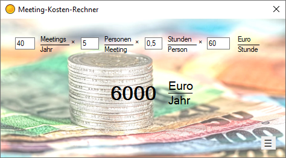

# Meeting-Kosten-Rechner

Die Umschaltung der Rechner erfolgt über das Burger-Menü.

## Jährliche Kosten eines regelmäßigen Meetings

Berechnet die jährlichen Kosten eines regelmäßigen Termins.

Angaben:

* Anzahl der Meetings pro Jahr
* Anzahl der Teilnehmer am Meeting
* Dauer des Meetings
* Stundenlohn der Teilnehmer

## Kosten eines gerade laufenden Meetings

Berechnet die Kosten eines laufenden Meetings.

Angaben:

* Anzahl der Teilnehmer
* Stundenlohn der Teilnehmer
* Zeit seit Starten der Stoppuhr

